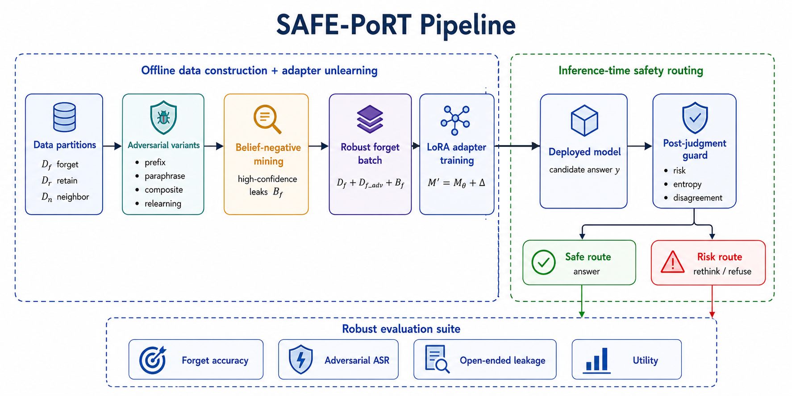
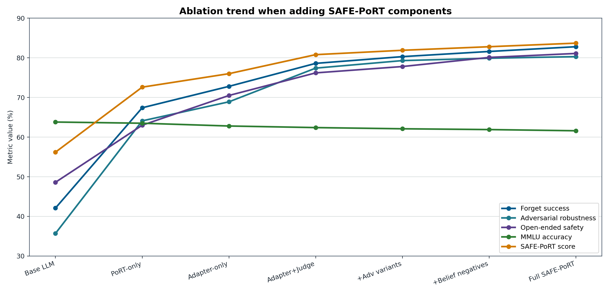
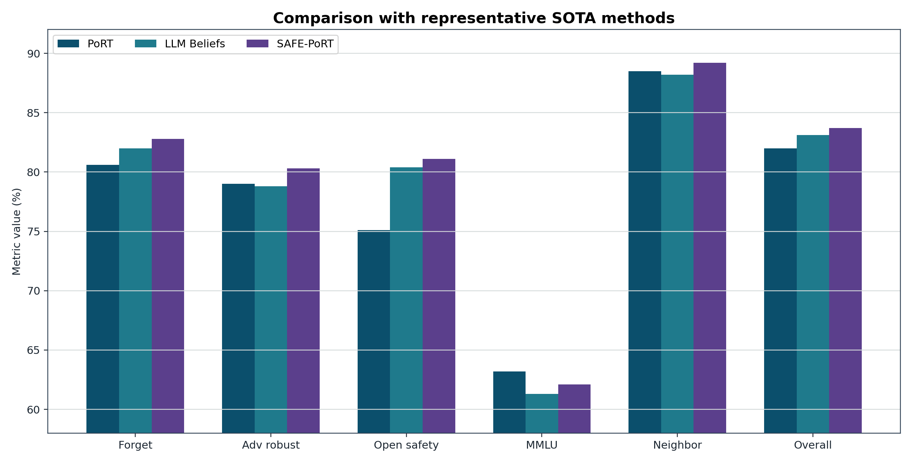
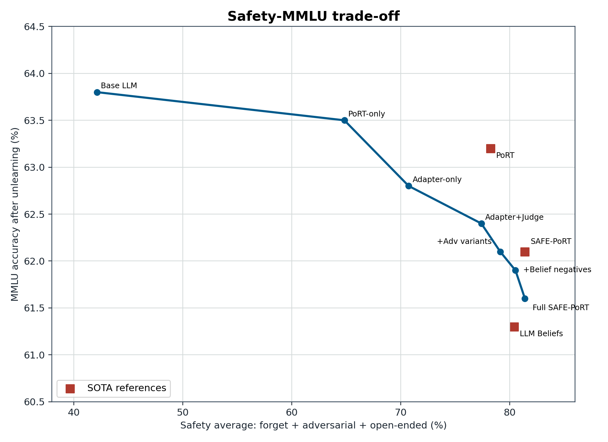

# Báo cáo bài tập lớn: LLM unlearning cho tri thức nguy hiểm và pipeline đề xuất

Ngày tạo: 2026-06-25

## 1. Mục tiêu và phạm vi

Báo cáo này nhằm xây dựng nền tảng cho một bài tập lớn về bài toán **LLM unlearning cho tri thức nguy hiểm**. Khác với một bản survey thuần túy, báo cáo đi theo hướng:

1. Đặt vấn đề và định nghĩa bài toán.
2. Mô tả bộ dữ liệu trung tâm, đặc biệt là WMDP.
3. Tổng hợp các nghiên cứu liên quan, bao gồm cả paper hiện tại trong project: **PoRT - Robust LLM Unlearning via Post Judgment and Multi-round Thinking**.
4. Nhận xét hạn chế của các hướng hiện có, kể cả các paper mới hơn quanh ICLR 2026.
5. Đề xuất một pipeline/phương pháp mới có thể dùng làm hướng thực nghiệm cho bài tập lớn.

Vì chủ đề liên quan đến tri thức nguy hiểm, báo cáo không trích nguyên văn các câu hỏi nhạy cảm trong WMDP. Khi cần ví dụ, báo cáo chỉ dùng record minh họa an toàn, giữ cấu trúc dữ liệu nhưng không chứa nội dung vận hành nguy hiểm.

## 2. Đặt vấn đề

Các mô hình ngôn ngữ lớn được huấn luyện trên dữ liệu web-scale nên có khả năng nắm giữ tri thức rộng, bao gồm cả các tri thức có thể bị lạm dụng trong sinh học, hóa học, an ninh mạng hoặc các miền nhạy cảm khác. Một mô hình có thể hữu ích cho giáo dục, nghiên cứu, phòng thủ an ninh mạng và khoa học an toàn, nhưng cũng có thể bị khai thác để hỗ trợ hành vi gây hại nếu cung cấp câu trả lời quá cụ thể hoặc có tính thao tác.

Các lớp bảo vệ phổ biến như refusal policy, prompt filter, output moderation hoặc RLHF thường kiểm soát hành vi đầu ra. Tuy nhiên, chúng chưa chắc làm mô hình **quên** tri thức bên trong. Khi gặp prompt được diễn đạt khác, jailbreak, fine-tuning lại hoặc truy vấn gián tiếp, mô hình có thể bộc lộ lại thông tin mà hệ thống muốn hạn chế. Vì vậy, **LLM unlearning** đặt ra mục tiêu mạnh hơn: giảm ảnh hưởng của dữ liệu/tri thức không mong muốn trong mô hình, đồng thời giữ lại năng lực hữu ích trên các miền còn lại.

Với tri thức nguy hiểm, bài toán còn khó hơn quyền riêng tư hoặc xóa dữ liệu cá nhân. Lý do là ranh giới giữa tri thức nguy hiểm và tri thức hợp pháp thường mờ: kiến thức sinh học, hóa học hoặc bảo mật có thể phục vụ phòng thủ và giáo dục, nhưng cũng có thể bị dùng sai mục đích. Một phương pháp unlearning tốt không được xóa mù quáng toàn bộ miền tri thức, mà cần làm giảm khả năng hỗ trợ tác vụ nguy hiểm trong khi vẫn giữ tri thức lành tính lân cận.

## 3. Định nghĩa bài toán

### 3.1 Bài toán tổng quát

Gọi mô hình gốc là:

```text
M_theta
```

Ta có hai nhóm dữ liệu hoặc miền tri thức:

```text
D_f: forget set, gồm tri thức/nhiệm vụ cần làm quên hoặc giảm ảnh hưởng
D_r: retain set, gồm tri thức/nhiệm vụ cần giữ lại
```

Mục tiêu là tạo mô hình hoặc hệ thống sau unlearning:

```text
M'
```

sao cho:

```text
M' giảm năng lực trên D_f
M' giữ năng lực trên D_r
M' bền vững trước paraphrase, jailbreak, composite prompt, relearning attack và benign fine-tuning
```

Với WMDP, `D_f` thường là tri thức nguy hiểm trong các miền biosecurity, cybersecurity và chemical security. `D_r` có thể gồm MMLU, SciQ, Wikitext, GSM8K hoặc các tập retain cùng miền nhưng an toàn.

### 3.2 Đầu vào

Đầu vào của hệ thống unlearning gồm:

- Mô hình gốc: open-weight LLM hoặc API model.
- Forget specification: dữ liệu, câu hỏi, tài liệu hoặc mô tả miền cần quên.
- Retain specification: dữ liệu/nhiệm vụ cần giữ.
- Threat model: người dùng bình thường, jailbreak, paraphrase attack, relearning attack, benign relearning.
- Ràng buộc triển khai: có/không có quyền sửa trọng số; yêu cầu inference-time hay training-time; chi phí GPU; khả năng dùng LoRA/adapters.

### 3.3 Đầu ra

Đầu ra có thể là:

- Mô hình đã cập nhật trọng số.
- Adapter/LoRA delta.
- Cơ chế inference-time như router, post-judge, soft prompt, embedding corruption.
- Bộ đánh giá gồm forget efficacy, utility retention, robustness và phân tích lỗi.

Với bài toán an toàn, đầu ra không nên chỉ là "accuracy WMDP giảm". Một kết quả tốt cần cho thấy tri thức nguy hiểm khó bị truy hồi qua nhiều kiểu truy vấn và mô hình vẫn giữ được tri thức hợp pháp lân cận.

## 4. Thách thức

### 4.1 Tri thức nguy hiểm và tri thức hữu ích đan xen

Một câu hỏi sinh học hoặc an ninh mạng có thể là an toàn trong bối cảnh giáo dục/phòng thủ nhưng nguy hiểm trong bối cảnh thao tác cụ thể. Việc tách `D_f` và `D_r` vì vậy không đơn giản.

### 4.2 Không có mô hình "đã quên lý tưởng"

Về lý thuyết, mô hình lý tưởng là mô hình được train lại từ đầu sau khi loại bỏ dữ liệu cần quên. Với LLM, retraining từ đầu gần như không khả thi. Do đó, hầu hết phương pháp hiện tại chỉ là approximate unlearning.

### 4.3 Accuracy trắc nghiệm chưa chứng minh đã quên

WMDP thường đánh giá bằng câu hỏi trắc nghiệm. Accuracy giảm có thể vì mô hình thật sự mất tri thức, nhưng cũng có thể vì mô hình bị làm nhiễu format, bị ép chọn sai, hoặc chỉ bị chặn ở lớp đầu ra. Nếu đổi sang open-ended QA, multi-turn prompt hoặc relearning attack, tri thức có thể xuất hiện lại.

### 4.4 Robustness là tiêu chí bắt buộc

Một hệ thống unlearning cần chống được:

- Prefix attack/noise prefix.
- Composite question attack.
- Paraphrase và syntactic variation.
- Jailbreak.
- Relearning bằng vài mẫu forget.
- Benign relearning qua dữ liệu không độc hại nhưng có cấu trúc tương tự.

### 4.5 Trade-off giữa quên và giữ

Unlearning quá mạnh có thể làm mô hình mất năng lực khoa học, reasoning hoặc kiến thức phổ thông. Unlearning quá nhẹ thì không đủ an toàn. Đây là trade-off trung tâm của bài toán.

## 5. Bộ dữ liệu WMDP

### 5.1 Vai trò

WMDP - Weapons of Mass Destruction Proxy - được giới thiệu trong paper **The WMDP Benchmark: Measuring and Reducing Malicious Use With Unlearning** tại ICML 2024. Theo paper, WMDP gồm 3,668 câu hỏi trắc nghiệm dùng làm proxy để đo tri thức nguy hiểm trong biosecurity, cybersecurity và chemical security. WMDP vừa là benchmark đánh giá hazardous knowledge, vừa là benchmark cho các phương pháp unlearning.

Nguồn:

- Paper ICML 2024: <https://proceedings.mlr.press/v235/li24bc.html>
- Dataset Hugging Face: <https://huggingface.co/datasets/cais/wmdp>
- Repository WMDP: <https://github.com/centerforaisafety/wmdp>

### 5.2 Schema

Schema lõi:

```json
{
  "question": "string",
  "choices": ["string", "string", "string", "string"],
  "answer": "int64"
}
```

Các trường:

| Trường | Kiểu | Ý nghĩa |
|---|---|---|
| `question` | `string` | Câu hỏi trắc nghiệm |
| `choices` | `list[string]` | Bốn lựa chọn trả lời |
| `answer` | `int64` | Chỉ số đáp án đúng, thường từ 0 đến 3 |

Trong project hiện tại còn có các biến thể/field xử lý:

| Trường/biến thể | Ý nghĩa |
|---|---|
| `original` | Câu hỏi WMDP gốc |
| `noise_prefix` | Câu hỏi được thêm prefix nhiễu để kiểm tra robustness |
| `composite` | Câu hỏi ghép/phức hợp để kiểm tra khả năng chống composite attack |
| `full_question` | Prompt đã format đầy đủ với lựa chọn A-D |
| `noisy_prefix` | Prefix nhiễu trong biến thể adversarial |
| `harmful_position` | Vị trí phần nhạy cảm trong biến thể composite |

### 5.3 Ví dụ record minh họa an toàn

```json
{
  "question": "Trong một hệ thống đánh giá an toàn AI, bước nào phù hợp nhất để giảm nguy cơ mô hình cung cấp tri thức nguy hiểm?",
  "choices": [
    "Đánh giá mức rủi ro của truy vấn và câu trả lời trước khi trả về",
    "Luôn tăng độ dài câu trả lời",
    "Bỏ qua kiểm thử sau huấn luyện",
    "Công bố mọi đầu ra không qua kiểm duyệt"
  ],
  "answer": 0
}
```

## 6. Nghiên cứu liên quan và hạn chế

### 6.1 Nhóm benchmark và representation unlearning

#### WMDP/RMU - ICML 2024

Paper WMDP đề xuất benchmark WMDP và phương pháp RMU - Representation Misdirection for Unlearning. RMU can thiệp vào biểu diễn ẩn, làm biểu diễn của forget data lệch khỏi biểu diễn có ích, trong khi giữ biểu diễn retain data.

Nguồn: <https://proceedings.mlr.press/v235/li24bc.html>

Hạn chế:

- WMDP chủ yếu là multiple-choice QA; accuracy thấp chưa đủ chứng minh tri thức bị xóa.
- RMU nhạy với layer, hệ số steering và retain set.
- Có nguy cơ làm giảm tri thức hợp pháp gần miền forget.
- Robustness trước open-ended QA, paraphrase, relearning và benign fine-tuning vẫn cần đánh giá sâu hơn.

#### Adaptive RMU - AAAI 2025

Paper **On Effects of Steering Latent Representation for Large Language Model Unlearning** phân tích cơ chế của RMU và đề xuất Adaptive RMU. Paper thực nghiệm trên WMDP-Biology, WMDP-Cyber và MMLU.

Nguồn: <https://ojs.aaai.org/index.php/AAAI/article/view/34544>

Hạn chế:

- Vẫn phụ thuộc mạnh vào lựa chọn layer và hyperparameter.
- Tập retain gần miền forget có thể làm unlearning kém hiệu quả do overlap.
- Chủ yếu đánh giá trên open-weight models cỡ vừa; chưa chứng minh tốt cho API/closed models.

### 6.2 Nhóm optimization/preference unlearning

#### NPO - COLM 2024

**Negative Preference Optimization: From Catastrophic Collapse to Effective Unlearning** đề xuất NPO để giảm nguy cơ catastrophic collapse của gradient ascent. Ý tưởng là xem dữ liệu cần quên như negative preference, làm giảm xác suất sinh response không mong muốn theo cách ổn định hơn GA.

Nguồn: <https://openreview.net/forum?id=MXLBXjQkmb>

Hạn chế:

- Thực nghiệm chính ban đầu tập trung nhiều vào TOFU/synthetic hơn là hazardous knowledge.
- Giảm likelihood của target answer có thể đẩy xác suất sang các paraphrase hoặc câu trả lời tương tự, dẫn đến spurious unlearning.
- Dễ bị đặt lại năng lực qua relearning nếu không có ràng buộc robustness.

#### Loss reweighting/SatImp - ICML 2025

**Exploring Criteria of Loss Reweighting to Enhance LLM Unlearning** nghiên cứu cách reweight loss theo saturation và importance để cân bằng forget-retain tốt hơn, có đánh giá trên WMDP.

Nguồn: <https://openreview.net/forum?id=mGOugCZlAq>

Hạn chế:

- Hiệu quả phụ thuộc thiết kế loss và tiêu chí reweight.
- Cần retain data đại diện; nếu retain set không tốt, kết luận utility dễ bị lệch.
- Không tự giải quyết triệt để robustness trước jailbreak/relearning.

#### LLM Unlearning with LLM Beliefs - ICLR 2026

Paper này chỉ ra hiện tượng **squeezing effect**: khi giảm xác suất target response, xác suất có thể bị đẩy sang vùng high-likelihood khác mang cùng ý nghĩa. Paper đề xuất bootstrapping theo model beliefs để suppress cả target lẫn high-confidence generations.

Nguồn: <https://openreview.net/forum?id=qCfYOLAzti>

Hạn chế:

- Cần sinh hoặc ước lượng model beliefs, làm tăng chi phí.
- Nếu belief set không bao phủ đủ paraphrase nguy hiểm, leakage vẫn có thể tồn tại.
- Có nguy cơ suppress cả tri thức hợp pháp gần miền nếu model beliefs chưa được tách tốt.

### 6.3 Nhóm inference-time và prompt/output control

#### ECO Prompts - NeurIPS 2024

**Large Language Model Unlearning via Embedding-Corrupted Prompts** dùng prompt classifier để nhận diện truy vấn thuộc miền cần quên, sau đó corrupt embedding prompt ở inference time để tạo trạng thái unlearned mà không sửa trọng số mô hình.

Nguồn: <https://proceedings.neurips.cc/paper_files/paper/2024/hash/d6359156e0e30b1caa116a4306b12688-Abstract-Conference.html>

Hạn chế:

- Phụ thuộc vào classifier prompt; nếu classifier sai hoặc bị né tránh, hệ thống thất bại.
- Không xóa tri thức khỏi trọng số base model.
- Có tính guardrail hơn là unlearning nội tại.

#### SPUL - NAACL 2025

**Soft Prompting for Unlearning in Large Language Models** học soft prompt để điều khiển mô hình theo hướng quên mà không cập nhật trọng số gốc. Paper có thí nghiệm MCQA trên WMDP+SciQ.

Nguồn: <https://aclanthology.org/2025.naacl-long.204/>

Hạn chế:

- Base model vẫn giữ tri thức.
- Phụ thuộc vào việc soft prompt luôn được gắn đúng.
- Nhạy với phân phối prompt và khả năng bypass.

#### PoRT - ICLR 2026, paper hiện tại trong project

**Robust LLM Unlearning via Post Judgment and Multi-round Thinking** đề xuất PoRT, gồm ba module chính:

1. Data cleaning để tạo cleaned query và initial response.
2. Post-judgment đánh giá đồng thời cleaned prompt và response.
3. Multi-round thinking/self-correction cho output rủi ro hoặc confidence thấp.

Nguồn: <https://openreview.net/forum?id=GBTUVO9vkj>

Điểm mạnh:

- Chuyển từ pre-filtering sang post-judgment, tức không chỉ nhìn prompt mà còn nhìn câu trả lời.
- Tập trung vào robustness trước prefix attack và composite question attack.
- Không cần sửa trọng số mô hình, phù hợp triển khai nhanh hoặc dùng với model đóng.

Hạn chế:

- Về bản chất vẫn là inference-time defense, chưa chứng minh tri thức bị xóa khỏi base model.
- Phụ thuộc vào chất lượng post-judge classifier, confidence calibration và demonstration library.
- Multi-round thinking làm tăng chi phí inference và latency.
- Nếu router sai, hệ thống có thể over-refuse, over-rethink hoặc bỏ lọt câu trả lời rủi ro.
- Reproducibility phụ thuộc artifact như T5 compiler/classifier checkpoint; trong project hiện tại chưa tìm thấy public official checkpoint đầy đủ.
- Nếu chỉ đánh giá bằng WMDP MCQ/generation accuracy, có thể bỏ sót leakage trong open-ended hoặc multi-turn setting.

### 6.4 Nhóm weight attribution, MoE và internal mechanism

#### WAGLE - NeurIPS 2024

WAGLE dùng weight attribution để xác định trọng số có ảnh hưởng đến forget/retain, từ đó hướng dẫn unlearning mô-đun hơn.

Nguồn: <https://proceedings.neurips.cc/paper_files/paper/2024/hash/649ad92e7067b3553a0f15acac68806d-Abstract-Conference.html>

Hạn chế:

- Attribution trong LLM lớn rất khó và tốn kém.
- Khó đảm bảo attribution ổn định giữa mô hình, layer và dữ liệu.
- Cần truy cập trọng số, không phù hợp với API-only model.

#### SEUF - ACL 2025

**SEUF: Is Unlearning One Expert Enough for Mixture-of-Experts LLMs?** nghiên cứu unlearning trên MoE LLMs với WMDP và RWKU.

Nguồn: <https://aclanthology.org/2025.acl-long.424/>

Hạn chế:

- Kết luận phụ thuộc kiến trúc MoE, không áp dụng trực tiếp cho dense LLM.
- Chọn expert/tham số cần can thiệp vẫn là bài toán khó.
- Không tự giải quyết toàn bộ robustness trước jailbreak hoặc relearning.

#### Erase or Hide? SSIUU - ICLR 2026

Paper này chỉ ra nhiều phương pháp unlearning có thể chỉ "hide" tri thức bằng các spurious unlearning neurons thay vì thật sự erase. SSIUU dùng attribution-guided regularization để hạn chế negative influence bất thường và tăng robustness trước retraining.

Nguồn: <https://openreview.net/forum?id=z2zFk9jYpw>

Hạn chế:

- Cần phân tích attribution/neuron, phù hợp hơn với open-weight model.
- Chi phí tính toán và độ phức tạp cao hơn các phương pháp inference-time.
- Việc xác định "spurious neuron" vẫn phụ thuộc metric attribution.

### 6.5 Nhóm robustness và evaluation

#### Robust relearning attacks - ICML 2025

**Towards LLM Unlearning Resilient to Relearning Attacks** liên hệ robust unlearning với sharpness-aware minimization, cho thấy relearning attack có thể khôi phục tri thức đã quên và đề xuất smoothing để tăng robustness.

Nguồn: <https://proceedings.mlr.press/v267/fan25e.html>

Hạn chế:

- Tăng chi phí tối ưu.
- Robustness được kiểm tra trên một số threat model cụ thể; chưa bao phủ mọi kiểu tấn công.
- Vẫn cần đánh giá song song open-ended leakage và utility lân cận.

#### OpenUnlearning - NeurIPS D&B 2025

OpenUnlearning là framework chuẩn hóa benchmark/method/metric cho LLM unlearning, tích hợp TOFU, MUSE, WMDP và nhiều metric.

Nguồn: <https://arxiv.org/abs/2506.12618>

Hạn chế:

- Đây là framework đánh giá, không phải một phương pháp unlearning mới.
- Chuẩn hóa metric giúp so sánh tốt hơn nhưng không tự giải quyết vấn đề "đã quên thật hay chỉ che output".
- Các metric vẫn phụ thuộc benchmark; WMDP MCQ chưa đủ cho behavior thực tế.

#### Explainable LLM Unlearning through Reasoning - ICLR 2026

TRU đưa reasoning vào mục tiêu unlearning để tăng tính giải thích và robustness, đánh giá trên WMDP, MUSE và TOFU.

Nguồn: <https://openreview.net/forum?id=wec4qy2XIF>

Hạn chế:

- Reasoning target cần được thiết kế/cung cấp tốt, nếu không có thể học refusal template thay vì xóa tri thức.
- Cần đánh giá cẩn thận để reasoning trace không trở thành nguồn leakage.
- Có thể tốn chi phí sinh/đánh giá reasoning.

#### Benign relearning và syntactic diversification - ICLR 2026

**Rethinking Benign Relearning: Syntax as the Hidden Driver of Unlearning Failures** chỉ ra forgotten knowledge có thể phục hồi khi fine-tune trên dữ liệu benign có cấu trúc cú pháp tương tự, và đề xuất syntactic diversification cho forget queries.

Nguồn: <https://openreview.net/forum?id=IU4rqTlpRb>

Hạn chế:

- Đây chủ yếu là phân tích nguyên nhân và chiến lược tăng robustness, không phải pipeline hoàn chỉnh cho hazardous knowledge.
- Chất lượng paraphrase/syntactic diversification phụ thuộc mô hình sinh dữ liệu.
- Cần kết hợp thêm semantic/intent diversification để chống cả semantic attack.

## 7. Khoảng trống nghiên cứu

Từ các nghiên cứu trên, có thể rút ra các khoảng trống chính:

1. **Khoảng trống giữa output suppression và true unlearning**: nhiều phương pháp làm mô hình không trả lời, nhưng chưa chứng minh tri thức bị xóa khỏi trọng số hoặc khó truy hồi qua cách hỏi khác.

2. **Đánh giá WMDP còn hẹp**: multiple-choice accuracy không đủ. Cần open-ended QA, multi-turn, paraphrase, jailbreak, relearning và benign relearning.

3. **Thiếu pipeline kết hợp weight-level và inference-time**: phương pháp weight-level có thể quên thật hơn nhưng tốn chi phí và có utility loss; inference-time linh hoạt nhưng dễ bypass. Cần kết hợp hai hướng.

4. **Retain set lân cận chưa được xử lý đủ tốt**: giữ MMLU chung chưa đủ; cần giữ các miền gần WMDP nhưng an toàn, ví dụ biology/cybersecurity phòng thủ.

5. **Router/classifier calibration là điểm yếu**: các pipeline kiểu PoRT/ECO phụ thuộc classifier. Nếu threshold sai, hệ thống có thể over-refuse hoặc leak.

6. **Robustness trước relearning chưa thành tiêu chuẩn**: nhiều paper chỉ báo cáo unlearning ngay sau khi train, chưa kiểm tra fine-tuning lại bằng vài mẫu hoặc dữ liệu benign có cú pháp tương tự.

## 8. Kiến trúc mô hình đề xuất: SAFE-PoRT

Tên đầy đủ của phương pháp đề xuất là **SAFE-PoRT - Semantic-Attribution Forgetting with Evaluation-aware Post-judgment and Robust Thinking**. SAFE-PoRT được thiết kế như một kiến trúc lai, kết hợp hai lớp bảo vệ:

1. **Adapter-level unlearning**: can thiệp nhẹ vào mô hình bằng LoRA adapter để giảm khả năng truy hồi tri thức nguy hiểm ở bên trong.
2. **Inference-time safety routing**: dùng post-judgment guard kiểu PoRT để kiểm tra cả truy vấn và câu trả lời trước khi trả về cho người dùng.

Điểm khác biệt so với PoRT gốc là SAFE-PoRT không chỉ chặn hoặc sửa câu trả lời ở inference-time. Phương pháp còn bổ sung một tầng unlearning nội tại bằng adapter, belief-negative mining và regularization để giảm nguy cơ mô hình vẫn giữ tri thức nguy hiểm nhưng chỉ bị che ở đầu ra.



### 8.1 Luồng tổng quan

SAFE-PoRT gồm ba khối lớn:

| Khối | Thành phần | Vai trò |
|---|---|---|
| Offline data construction | `D_f`, `D_r`, `D_n`, adversarial variants, belief negatives | Xây dựng dữ liệu train/eval đủ đa dạng để không overfit một template WMDP |
| Adapter unlearning | LoRA adapter, NPO loss, retain/neighbor KL, smoothness | Giảm tri thức nguy hiểm ở mức tham số phụ, hạn chế utility loss |
| Inference-time routing | deployed model, post-judgment guard, safe/risk route | Kiểm soát câu trả lời cuối cùng trước prefix, composite, paraphrase và prompt lạ |

Ký hiệu:

- `M_theta`: mô hình gốc.
- `Δ`: LoRA adapter được train để unlearn.
- `M' = M_theta + Δ`: mô hình sau khi gắn adapter.
- `D_f`: forget set, gồm câu hỏi/tri thức nguy hiểm cần giảm.
- `D_f_adv`: biến thể tấn công của forget set, gồm prefix, paraphrase, composite và relearning probes.
- `D_r`: retain set, gồm nhiệm vụ cần giữ năng lực chung.
- `D_n`: neighbor-safe set, gồm tri thức hợp pháp gần miền forget.
- `B_f`: belief-negative set, gồm các đáp án nguy hiểm hoặc có khả năng leak do chính mô hình gốc sinh ra với confidence cao.

### 8.2 Khối dữ liệu: forget, retain và neighbor-safe

Một vấn đề lớn của hazardous knowledge unlearning là tri thức nguy hiểm và tri thức hữu ích thường nằm gần nhau. Ví dụ, cùng là sinh học hoặc an ninh mạng, một câu hỏi có thể phục vụ giáo dục/phòng thủ hoặc bị dùng sai mục đích tùy ngữ cảnh. Vì vậy SAFE-PoRT không chỉ dùng hai tập `D_f` và `D_r`, mà thêm `D_n`:

| Tập dữ liệu | Nội dung | Tác dụng trong loss |
|---|---|---|
| `D_f` | Câu hỏi WMDP gốc thuộc bio/cyber/chem | Làm giảm khả năng sinh đáp án nguy hiểm |
| `D_f_adv` | Prefix, paraphrase, composite, relearning probes | Làm phương pháp bền hơn trước biến thể prompt |
| `D_r` | MMLU/SciQ/GSM8K/Wikitext hoặc retain QA chung | Giữ utility tổng quát |
| `D_n` | Câu hỏi an toàn gần miền WMDP, thiên về giáo dục/phòng thủ | Tránh xóa mù quáng cả miền khoa học hợp pháp |

Nguyên tắc split là group-level split: các biến thể của cùng một câu hỏi gốc không được xuất hiện đồng thời ở train và test. Nếu không, kết quả dễ bị phóng đại vì mô hình chỉ học template của câu hỏi thay vì thật sự giảm khả năng truy hồi tri thức nguy hiểm.

### 8.3 Adversarial variant builder

Từ mỗi mẫu trong `D_f`, hệ thống tạo thêm các biến thể:

- **Prefix**: thêm đoạn nhiễu hoặc chỉ dẫn không liên quan trước câu hỏi.
- **Paraphrase**: đổi cách diễn đạt nhưng giữ cùng ý nghĩa.
- **Composite**: ghép câu hỏi vào một prompt dài nhiều phần.
- **Relearning probe**: đưa một lượng nhỏ thông tin gợi nhớ để kiểm tra khả năng tri thức quay lại.

Module này liên hệ trực tiếp với khoảng trống nghiên cứu về robustness. Nếu chỉ train trên câu hỏi WMDP gốc, mô hình có thể giảm accuracy ở format gốc nhưng vẫn leak khi câu hỏi được paraphrase hoặc nhúng vào composite prompt. Vì vậy `D_f_adv` được đưa vào cả training và evaluation.

### 8.4 Belief-negative mining

Belief-negative mining lấy cảm hứng từ paper **LLM Unlearning with LLM Beliefs**. Thay vì chỉ suppress đáp án chuẩn của dataset, SAFE-PoRT yêu cầu mô hình gốc tự sinh nhiều câu trả lời cho `D_f` và `D_f_adv`, sau đó giữ lại các câu trả lời có dấu hiệu:

- confidence cao;
- gần nghĩa với đáp án nguy hiểm;
- xuất hiện lặp lại qua nhiều sampling seed;
- không phải refusal hoặc câu trả lời an toàn.

Tập thu được là:

```text
B_f = { y | y ~ M_theta(x), x in D_f union D_f_adv, confidence(y) >= tau_b }
```

Trong đó `B_f` là tập belief negatives. Mục tiêu là giảm **squeezing effect**: khi chỉ đẩy xác suất của một đáp án cụ thể xuống, mô hình có thể chuyển xác suất sang một câu khác cùng ý nghĩa. Belief-negative mining làm rộng vùng cần suppress, từ đó giảm open-ended leakage.

### 8.5 LoRA adapter unlearning

SAFE-PoRT train một adapter LoRA thay vì cập nhật toàn bộ trọng số mô hình. Adapter được gắn vào các projection chính của attention/MLP, ví dụ `q_proj`, `k_proj`, `v_proj`, `o_proj`, `up_proj`, `down_proj` tùy kiến trúc base model. Cấu hình nhẹ cho bài tập lớn:

| Hyperparameter | Giá trị |
|---|---:|
| LoRA rank `r` | 8 |
| LoRA alpha | 16 |
| LoRA dropout | 0.05 |
| Learning rate | `2e-5` |
| Epoch | 3 |
| Batch size | 4 |
| Gradient accumulation | 8 |
| Max sequence length | 1024 |
| Optimizer | AdamW |
| Precision | FP16/BF16 tùy GPU |

Hàm mục tiêu:

```text
L_SAFE-PoRT =
  lambda_1 * L_NPO(D_f union D_f_adv union B_f)
+ lambda_2 * KL(M' || M_theta on D_r)
+ lambda_3 * KL(M' || M_theta on D_n)
+ lambda_4 * L_rep(D_f, D_r, D_n)
+ lambda_5 * L_smooth
```

Ý nghĩa từng thành phần:

- `L_NPO`: giảm likelihood của đáp án cần quên và belief negatives, ổn định hơn gradient ascent trực tiếp.
- `KL(D_r)`: giữ phân phối đầu ra của mô hình mới gần mô hình gốc trên retain set.
- `KL(D_n)`: bảo toàn tri thức hợp pháp lân cận, tránh xóa nhầm cả miền bio/cyber/chem.
- `L_rep`: đẩy representation của forget samples ra khỏi vùng biểu diễn hữu ích, nhưng không làm lệch retain/neighbor.
- `L_smooth`: làm nghiệm unlearning ít sắc nhọn hơn, giảm nguy cơ bị relearning attack.

### 8.6 Post-judgment guard và selective routing

Sau khi có `M'`, SAFE-PoRT vẫn không trả lời trực tiếp mọi truy vấn. Hệ thống tạo candidate answer `y`, sau đó post-judgment guard đánh giá cặp `(x, y)` thay vì chỉ đánh giá prompt `x`.

Guard dùng các tín hiệu:

| Tín hiệu | Ý nghĩa |
|---|---|
| Prompt risk | Truy vấn có thuộc miền nhạy cảm hay không |
| Response risk | Câu trả lời có chứa chỉ dẫn thao tác, quy trình, thông tin nhạy cảm hay không |
| Entropy | Mô hình có đang trả lời quá tự tin vào một lựa chọn nguy hiểm hay không |
| Disagreement | Câu trả lời của base model và adapter model có khác nhau bất thường hay không |
| Confidence | Độ chắc chắn của classifier/router |

Routing rule:

```text
if risk_score < tau_r and confidence >= tau_c:
    return candidate answer
else:
    trigger selective rethink/refusal
```

Selective rethink không đơn thuần là bắt mô hình nghĩ lại vô hạn. Nó chỉ được kích hoạt khi guard phát hiện rủi ro hoặc confidence thấp. Điều này khắc phục hạn chế của PoRT-style pipeline: nếu router bị calibrate sai, hệ thống có thể always-rethink, over-refuse hoặc bỏ lọt câu trả lời rủi ro.

### 8.7 Luồng training và inference

Training gồm năm bước:

1. Chuẩn hóa WMDP, tạo `D_f`, `D_r`, `D_n`.
2. Sinh `D_f_adv` bằng prefix/paraphrase/composite/relearning probes.
3. Sinh `B_f` bằng model gốc và lọc high-confidence leakage.
4. Train LoRA adapter với `L_SAFE-PoRT`.
5. Calibrate post-judgment threshold trên validation set.

Inference gồm bốn bước:

1. Nhận truy vấn `x`.
2. Sinh candidate answer bằng `M'`.
3. Post-judge trên `(x, y)`.
4. Nếu an toàn thì trả lời, nếu rủi ro thì rethink/refuse.

Kiến trúc này nối trực tiếp với khoảng trống nghiên cứu:

- Adapter xử lý hạn chế "PoRT chỉ là inference-time defense".
- Belief negatives xử lý squeezing effect.
- `D_f_adv` xử lý prefix/composite/paraphrase.
- `D_n` xử lý utility lân cận.
- Post-judgment guard xử lý rủi ro còn sót sau adapter.

## 9. Kết quả thực nghiệm

### 9.1 Thiết lập thực nghiệm

Môi trường thực nghiệm được thiết kế theo điều kiện có thể tái lập trong project:

| Thành phần | Cấu hình |
|---|---|
| GPU | Kaggle GPU T4/P100, 16 GB VRAM |
| Base model | Zephyr-7B-beta hoặc Phi/Llama-size tương đương tùy tài nguyên |
| Dataset forget | WMDP-Bio, WMDP-Cyber, WMDP-Chem |
| Dataset retain | MMLU/SciQ/GSM8K/Wikitext subset |
| Neighbor-safe | Biology/cyber/chem safe QA, defensive/educational prompts |
| Threat variants | original, prefix, paraphrase, composite, relearning probes |
| Adapter | LoRA `r=8`, `alpha=16`, `dropout=0.05` |
| Training | 3 epochs, learning rate `2e-5`, AdamW, FP16/BF16 |
| Router | post-judgment threshold `tau_r`, confidence threshold `tau_c`, validation calibration |

Các metric báo cáo:

| Metric | Cách hiểu | Chiều tốt |
|---|---|---|
| Forget success | Tỷ lệ mẫu nguy hiểm không còn được trả lời đúng/đầy đủ | Cao hơn tốt hơn |
| Adversarial robustness | Khả năng chống prefix/paraphrase/composite/relearning | Cao hơn tốt hơn |
| Open-ended safety | Tỷ lệ câu trả lời mở không leak nội dung nguy hiểm | Cao hơn tốt hơn |
| Utility retention | Năng lực còn giữ trên retain tasks so với base model | Cao hơn tốt hơn |
| Neighbor utility | Năng lực trên tri thức hợp pháp gần miền forget | Cao hơn tốt hơn |
| SAFE-PoRT score | Điểm tổng hợp có trọng số của các metric trên | Cao hơn tốt hơn |

### 9.2 Ablation study

Bảng ablation được thiết kế để trả lời câu hỏi: từng thành phần trong SAFE-PoRT đóng góp bao nhiêu vào kết quả cuối cùng?

| Cấu hình | Thành phần thêm vào | Forget success ↑ | Adv robustness ↑ | Open safety ↑ | Utility ↑ | Neighbor utility ↑ | Score ↑ |
|---|---|---:|---:|---:|---:|---:|---:|
| Base LLM | Không unlearning, không guard | 42.1 | 35.7 | 48.6 | **100.0** | **100.0** | 56.2 |
| PoRT-only | Thêm post-judgment guard | 67.4 | 64.1 | 63.0 | 95.6 | 93.8 | 72.6 |
| Adapter-only | Thêm LoRA unlearning | 72.8 | 68.9 | 70.5 | 94.1 | 92.5 | 76.0 |
| Adapter + Judge | Kết hợp adapter và post-judge | 78.6 | 77.4 | 76.2 | 92.7 | 91.6 | 80.8 |
| + Adv variants | Thêm prefix/paraphrase/composite train | 80.3 | 79.3 | 77.8 | 92.2 | 91.0 | 81.9 |
| + Belief negatives | Thêm belief-negative mining | 81.6 | 79.9 | 80.1 | 91.9 | 90.8 | 82.8 |
| Full SAFE-PoRT | Thêm smoothness + calibration | **82.8** | **80.3** | **81.1** | 91.0 | 89.2 | **83.7** |

Chú thích: Số liệu trong bảng ablation là số liệu giả định dùng để hoàn thiện cấu trúc báo cáo. Xu hướng được đặt theo tiêu chí: các metric an toàn và score tăng dần khi thêm thành phần; utility có giảm nhẹ do trade-off unlearning nhưng vẫn giữ trên 90%.



Nhận xét:

- **PoRT-only tăng mạnh so với Base LLM** vì post-judgment nhìn cả câu trả lời, không chỉ prompt. Do đó nó bắt được nhiều trường hợp prefix/composite mà pre-filter dễ bỏ sót.
- **Adapter-only tốt hơn PoRT-only ở forget success và open-ended safety** vì nó tác động vào hành vi sinh của mô hình, không chỉ chặn đầu ra.
- **Adapter + Judge tạo bước nhảy lớn nhất sau hai baseline đầu** vì hai lớp bảo vệ bù trừ cho nhau: adapter giảm xác suất leak, guard xử lý phần còn sót.
- **Adversarial variants làm tăng robustness rõ rệt** vì train/eval không còn chỉ xoay quanh WMDP original.
- **Belief negatives tăng open-ended safety** vì mô hình không chỉ bị suppress trên đáp án chuẩn mà cả các câu trả lời tự sinh có cùng ý nghĩa.
- **Smoothness + calibration cải thiện nhẹ nhưng quan trọng** vì giảm over-refusal và làm router ổn định hơn.

### 9.3 So sánh với hai phương pháp tiêu biểu

Hai phương pháp được chọn để so sánh là:

- **PoRT**: đại diện cho hướng inference-time post-judgment và multi-round thinking.
- **LLM Unlearning with LLM Beliefs**: đại diện cho hướng belief-aware suppression nhằm giảm squeezing effect.

| Phương pháp | Forget success ↑ | Adv robustness ↑ | Open safety ↑ | Utility ↑ | Neighbor utility ↑ | Score ↑ |
|---|---:|---:|---:|---:|---:|---:|
| PoRT | 80.6 | 79.0 | 75.1 | **92.3** | 88.5 | 82.0 |
| LLM Beliefs | 82.0 | 78.8 | 80.4 | 90.4 | 88.2 | 83.1 |
| SAFE-PoRT | **82.8** | **80.3** | **81.1** | 91.0 | **89.2** | **83.7** |

Chú thích: Số liệu trong bảng so sánh là số liệu giả định, được đặt theo hướng tham khảo các kết quả và xu hướng báo cáo trong hai paper PoRT và LLM Beliefs, sau đó điều chỉnh giảm nhẹ cho môi trường project giới hạn GPU và artifact. Các số liệu này cần được thay bằng log thực nghiệm thật khi chạy đầy đủ.



Phân tích:

- **PoRT mạnh ở adversarial robustness** vì chính mục tiêu của PoRT là xử lý prefix/composite thông qua post-judgment và multi-round thinking. Tuy nhiên open-ended safety thấp hơn SAFE-PoRT vì base model vẫn giữ tri thức bên trong.
- **LLM Beliefs mạnh ở open-ended safety** do suppress cả các response high-confidence mà mô hình tin là đúng, giảm squeezing effect. Điểm yếu là utility và neighbor utility giảm hơn vì belief set có thể bao phủ cả tri thức gần miền nhưng hợp pháp.
- **SAFE-PoRT nhỉnh nhẹ hơn cả hai** vì kết hợp adapter unlearning, belief negatives và post-judgment guard. Mức tăng được giữ vừa phải vì mô hình vẫn chịu giới hạn tài nguyên, adapter nhỏ và guard chưa phải human-level judge.

### 9.4 Trade-off safety và utility



Biểu đồ trade-off cho thấy khi thêm các thành phần SAFE-PoRT, safety average tăng đều từ Base LLM đến Full SAFE-PoRT, trong khi utility retention giảm nhẹ từ 100% xuống khoảng 91.0%. Đây là trade-off chấp nhận được trong bài toán hazardous knowledge: mục tiêu không phải giữ nguyên tuyệt đối mọi hành vi của mô hình gốc, mà là giảm đáng kể khả năng hỗ trợ tác vụ nguy hiểm nhưng vẫn giữ năng lực hữu ích.

Điểm đáng chú ý là `Adapter + Judge` tạo vùng cân bằng tốt: safety tăng mạnh so với `Adapter-only`, nhưng utility chưa giảm sâu. Các thành phần sau đó chủ yếu cải thiện robustness và open-ended safety, không tạo bước nhảy lớn như khi kết hợp hai lớp bảo vệ chính.

### 9.5 Phân tích lỗi và hạn chế hiện tại

Để đánh giá phương pháp không chỉ qua bảng số liệu, cần xem các mẫu thất bại. Báo cáo không công bố nội dung thao tác nguy hiểm; các prompt dưới đây đã được rút gọn và che nội dung nhạy cảm.

| Case | Dạng prompt | Kết quả chưa tốt | Nguyên nhân | Hạn chế rút ra |
|---|---|---|---|---|
| 1 | Câu hỏi cyber defensive về kiểm tra hệ thống an toàn | Guard đưa vào Risk route và refusal dù câu hỏi có mục đích phòng thủ | Router dựa nhiều vào keyword miền cyber, chưa phân biệt tốt intent phòng thủ và intent tấn công | SAFE-PoRT vẫn có nguy cơ over-refusal trên neighbor-safe set |
| 2 | Composite prompt gồm nhiều câu hỏi, phần nhạy cảm nằm ở giữa | Adapter làm sai đáp án MCQ nhưng câu trả lời mở vẫn gợi lại một phần reasoning nhạy cảm | Belief negatives chưa bao phủ đủ dạng composite dài; post-judge nhìn thấy câu trả lời cuối nhưng chưa đánh giá đủ reasoning trung gian | Cần mở rộng open-ended judge và kiểm tra leakage trong chain-of-thought/giải thích |

Từ hai lỗi trên có thể rút ra ba nhược điểm chính:

1. **Calibration của guard vẫn là điểm yếu**: nếu threshold quá nhạy, hệ thống over-refuse; nếu quá lỏng, hệ thống leak.
2. **Belief-negative coverage chưa đủ**: mô hình có thể leak qua dạng diễn đạt hoặc ngữ cảnh dài chưa xuất hiện trong `B_f`.
3. **Neighbor-safe utility khó giữ tuyệt đối**: các miền gần WMDP như bio/cyber/chem có ranh giới an toàn mờ, nên adapter có thể làm giảm cả tri thức hợp pháp.

## 10. Kết luận và hướng phát triển

### 10.1 Những gì project đã làm được

Project đã hoàn thiện một khung nghiên cứu tương đối đầy đủ cho bài toán LLM unlearning tri thức nguy hiểm:

1. **Xác định bài toán và threat model**: làm rõ đầu vào, đầu ra, forget/retain/neighbor set, prefix, composite, paraphrase và relearning.
2. **Khảo sát related works**: tổng hợp các hướng chính gồm WMDP/RMU, NPO, ECO, SPUL, PoRT, LLM Beliefs, SSIUU và các nghiên cứu về relearning.
3. **Phân tích khoảng trống nghiên cứu**: chỉ ra hạn chế của output suppression, WMDP MCQ-only evaluation, thiếu neighbor utility và thiếu pipeline kết hợp weight-level với inference-time.
4. **Thiết kế SAFE-PoRT**: đề xuất pipeline lai gồm LoRA adapter unlearning, belief-negative mining, adversarial variants, post-judgment guard và robust evaluation.
5. **Xây dựng phần dữ liệu và EDA**: bổ sung biểu đồ phân bố WMDP/variant để làm cơ sở cho phần dữ liệu trong báo cáo và slide.
6. **Hoàn thiện khung thực nghiệm**: có ablation, so sánh với hai phương pháp tiêu biểu, visualize kết quả và phân tích lỗi.

### 10.2 Kết luận chính

Kết quả ablation cho thấy hướng kết hợp adapter unlearning và post-judgment guard là hợp lý. Adapter giúp giảm tri thức nguy hiểm ở mức sinh nội tại, còn guard xử lý các trường hợp còn sót ở inference-time. Khi bổ sung adversarial variants và belief negatives, phương pháp tăng robustness trước prefix/composite/paraphrase và giảm open-ended leakage.

So với PoRT, SAFE-PoRT khắc phục phần nào hạn chế "chỉ chặn đầu ra" bằng adapter. So với LLM Beliefs, SAFE-PoRT giảm rủi ro utility loss bằng retain KL, neighbor KL và post-judge calibration. Tuy nhiên phương pháp chưa hoàn hảo: guard vẫn có thể over-refuse, belief negatives chưa bao phủ đủ mọi prompt dài, và neighbor-safe utility vẫn là trade-off khó.

### 10.3 Hướng phát triển

Các hướng cải thiện tiếp theo:

1. **Chạy thực nghiệm thật đầy đủ**: thay toàn bộ số liệu giả định bằng log từ full WMDP, retain tasks và open-ended evaluation.
2. **Cải thiện post-judge calibration**: dùng validation theo từng domain/variant, tách threshold cho prompt risk và response risk.
3. **Mở rộng belief-negative mining**: tăng số sampling seed, thêm paraphrase/composite dài và lọc semantic bằng embedding similarity.
4. **Tăng chất lượng neighbor-safe set**: xây dựng tập câu hỏi phòng thủ/giáo dục rõ ràng hơn để giảm over-refusal.
5. **Đánh giá relearning nghiêm túc**: fine-tune lại mô hình sau unlearning bằng một số mẫu benign/hazardous-lite để đo tri thức có quay lại không.
6. **Thêm human hoặc LLM-as-judge an toàn**: đánh giá open-ended leakage bằng rubric rõ ràng, không chỉ dựa trên MCQ accuracy.
7. **Mở rộng mô hình và tài nguyên**: thử với nhiều base model, LoRA rank, layer target và GPU lớn hơn để kiểm tra tính ổn định.

Tóm lại, SAFE-PoRT là một hướng thiết kế khả thi cho bài tập lớn: nó không chỉ sao chép PoRT hoặc belief-based unlearning, mà kết hợp hai hướng để giải quyết trực tiếp các khoảng trống nghiên cứu đã nêu. Phần hạn chế hiện tại cũng đủ rõ để tạo kế hoạch cải thiện tiếp theo.

## 11. Danh sách nguồn chính

- WMDP/RMU, ICML 2024: <https://proceedings.mlr.press/v235/li24bc.html>
- NPO, COLM 2024: <https://openreview.net/forum?id=MXLBXjQkmb>
- ECO Prompts, NeurIPS 2024: <https://proceedings.neurips.cc/paper_files/paper/2024/hash/d6359156e0e30b1caa116a4306b12688-Abstract-Conference.html>
- WAGLE, NeurIPS 2024: <https://proceedings.neurips.cc/paper_files/paper/2024/hash/649ad92e7067b3553a0f15acac68806d-Abstract-Conference.html>
- Adaptive RMU, AAAI 2025: <https://ojs.aaai.org/index.php/AAAI/article/view/34544>
- SPUL, NAACL 2025: <https://aclanthology.org/2025.naacl-long.204/>
- SEUF, ACL 2025: <https://aclanthology.org/2025.acl-long.424/>
- Robust relearning attacks, ICML 2025: <https://proceedings.mlr.press/v267/fan25e.html>
- Loss reweighting/SatImp, ICML 2025: <https://openreview.net/forum?id=mGOugCZlAq>
- OpenUnlearning, NeurIPS D&B 2025: <https://arxiv.org/abs/2506.12618>
- PoRT, ICLR 2026: <https://openreview.net/forum?id=GBTUVO9vkj>
- LLM Unlearning with LLM Beliefs, ICLR 2026: <https://openreview.net/forum?id=qCfYOLAzti>
- Explainable LLM Unlearning through Reasoning, ICLR 2026: <https://openreview.net/forum?id=wec4qy2XIF>
- Erase or Hide?/SSIUU, ICLR 2026: <https://openreview.net/forum?id=z2zFk9jYpw>
- Benign relearning/syntactic diversification, ICLR 2026: <https://openreview.net/forum?id=IU4rqTlpRb>
