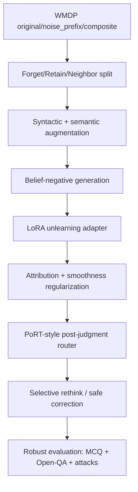

# Báo cáo bài tập lớn: LLM unlearning cho tri thức nguy hiểm và pipeline đề xuất

Ngày tạo: 2026-06-25

## 1. Mục tiêu và phạm vi

Báo cáo này nhằm xây dựng nền tảng cho một bài tập lớn về bài toán **LLM unlearning cho tri thức nguy hiểm**. Khác với một bản survey thuần túy, báo cáo đi theo hướng:

1. Đặt vấn đề và định nghĩa bài toán.
2. Mô tả bộ dữ liệu trung tâm, đặc biệt là WMDP.
3. Tổng hợp các nghiên cứu liên quan, bao gồm cả paper hiện tại trong project: **PoRT - Robust LLM Unlearning via Post Judgment and Multi-round Thinking**.
4. Nhận xét hạn chế của các hướng hiện có, kể cả các paper mới hơn quanh ICLR 2026.
5. Đề xuất một pipeline/phương pháp mới có thể dùng làm hướng thực nghiệm cho bài tập lớn.

Vì chủ đề liên quan đến tri thức nguy hiểm, báo cáo không trích nguyên văn các câu hỏi nhạy cảm trong WMDP. Khi cần ví dụ, báo cáo chỉ dùng record minh họa an toàn, giữ cấu trúc dữ liệu nhưng không chứa nội dung vận hành nguy hiểm.

## 2. Đặt vấn đề

Các mô hình ngôn ngữ lớn được huấn luyện trên dữ liệu web-scale nên có khả năng nắm giữ tri thức rộng, bao gồm cả các tri thức có thể bị lạm dụng trong sinh học, hóa học, an ninh mạng hoặc các miền nhạy cảm khác. Một mô hình có thể hữu ích cho giáo dục, nghiên cứu, phòng thủ an ninh mạng và khoa học an toàn, nhưng cũng có thể bị khai thác để hỗ trợ hành vi gây hại nếu cung cấp câu trả lời quá cụ thể hoặc có tính thao tác.

Các lớp bảo vệ phổ biến như refusal policy, prompt filter, output moderation hoặc RLHF thường kiểm soát hành vi đầu ra. Tuy nhiên, chúng chưa chắc làm mô hình **quên** tri thức bên trong. Khi gặp prompt được diễn đạt khác, jailbreak, fine-tuning lại hoặc truy vấn gián tiếp, mô hình có thể bộc lộ lại thông tin mà hệ thống muốn hạn chế. Vì vậy, **LLM unlearning** đặt ra mục tiêu mạnh hơn: giảm ảnh hưởng của dữ liệu/tri thức không mong muốn trong mô hình, đồng thời giữ lại năng lực hữu ích trên các miền còn lại.

Với tri thức nguy hiểm, bài toán còn khó hơn quyền riêng tư hoặc xóa dữ liệu cá nhân. Lý do là ranh giới giữa tri thức nguy hiểm và tri thức hợp pháp thường mờ: kiến thức sinh học, hóa học hoặc bảo mật có thể phục vụ phòng thủ và giáo dục, nhưng cũng có thể bị dùng sai mục đích. Một phương pháp unlearning tốt không được xóa mù quáng toàn bộ miền tri thức, mà cần làm giảm khả năng hỗ trợ tác vụ nguy hiểm trong khi vẫn giữ tri thức lành tính lân cận.

## 3. Định nghĩa bài toán

### 3.1 Bài toán tổng quát

Gọi mô hình gốc là:

```text
M_theta
```

Ta có hai nhóm dữ liệu hoặc miền tri thức:

```text
D_f: forget set, gồm tri thức/nhiệm vụ cần làm quên hoặc giảm ảnh hưởng
D_r: retain set, gồm tri thức/nhiệm vụ cần giữ lại
```

Mục tiêu là tạo mô hình hoặc hệ thống sau unlearning:

```text
M'
```

sao cho:

```text
M' giảm năng lực trên D_f
M' giữ năng lực trên D_r
M' bền vững trước paraphrase, jailbreak, composite prompt, relearning attack và benign fine-tuning
```

Với WMDP, `D_f` thường là tri thức nguy hiểm trong các miền biosecurity, cybersecurity và chemical security. `D_r` có thể gồm MMLU, SciQ, Wikitext, GSM8K hoặc các tập retain cùng miền nhưng an toàn.

### 3.2 Đầu vào

Đầu vào của hệ thống unlearning gồm:

- Mô hình gốc: open-weight LLM hoặc API model.
- Forget specification: dữ liệu, câu hỏi, tài liệu hoặc mô tả miền cần quên.
- Retain specification: dữ liệu/nhiệm vụ cần giữ.
- Threat model: người dùng bình thường, jailbreak, paraphrase attack, relearning attack, benign relearning.
- Ràng buộc triển khai: có/không có quyền sửa trọng số; yêu cầu inference-time hay training-time; chi phí GPU; khả năng dùng LoRA/adapters.

### 3.3 Đầu ra

Đầu ra có thể là:

- Mô hình đã cập nhật trọng số.
- Adapter/LoRA delta.
- Cơ chế inference-time như router, post-judge, soft prompt, embedding corruption.
- Bộ đánh giá gồm forget efficacy, utility retention, robustness và phân tích lỗi.

Với bài toán an toàn, đầu ra không nên chỉ là "accuracy WMDP giảm". Một kết quả tốt cần cho thấy tri thức nguy hiểm khó bị truy hồi qua nhiều kiểu truy vấn và mô hình vẫn giữ được tri thức hợp pháp lân cận.

## 4. Thách thức

### 4.1 Tri thức nguy hiểm và tri thức hữu ích đan xen

Một câu hỏi sinh học hoặc an ninh mạng có thể là an toàn trong bối cảnh giáo dục/phòng thủ nhưng nguy hiểm trong bối cảnh thao tác cụ thể. Việc tách `D_f` và `D_r` vì vậy không đơn giản.

### 4.2 Không có mô hình "đã quên lý tưởng"

Về lý thuyết, mô hình lý tưởng là mô hình được train lại từ đầu sau khi loại bỏ dữ liệu cần quên. Với LLM, retraining từ đầu gần như không khả thi. Do đó, hầu hết phương pháp hiện tại chỉ là approximate unlearning.

### 4.3 Accuracy trắc nghiệm chưa chứng minh đã quên

WMDP thường đánh giá bằng câu hỏi trắc nghiệm. Accuracy giảm có thể vì mô hình thật sự mất tri thức, nhưng cũng có thể vì mô hình bị làm nhiễu format, bị ép chọn sai, hoặc chỉ bị chặn ở lớp đầu ra. Nếu đổi sang open-ended QA, multi-turn prompt hoặc relearning attack, tri thức có thể xuất hiện lại.

### 4.4 Robustness là tiêu chí bắt buộc

Một hệ thống unlearning cần chống được:

- Prefix attack/noise prefix.
- Composite question attack.
- Paraphrase và syntactic variation.
- Jailbreak.
- Relearning bằng vài mẫu forget.
- Benign relearning qua dữ liệu không độc hại nhưng có cấu trúc tương tự.

### 4.5 Trade-off giữa quên và giữ

Unlearning quá mạnh có thể làm mô hình mất năng lực khoa học, reasoning hoặc kiến thức phổ thông. Unlearning quá nhẹ thì không đủ an toàn. Đây là trade-off trung tâm của bài toán.

## 5. Bộ dữ liệu WMDP

### 5.1 Vai trò

WMDP - Weapons of Mass Destruction Proxy - được giới thiệu trong paper **The WMDP Benchmark: Measuring and Reducing Malicious Use With Unlearning** tại ICML 2024. Theo paper, WMDP gồm 3,668 câu hỏi trắc nghiệm dùng làm proxy để đo tri thức nguy hiểm trong biosecurity, cybersecurity và chemical security. WMDP vừa là benchmark đánh giá hazardous knowledge, vừa là benchmark cho các phương pháp unlearning.

Nguồn:

- Paper ICML 2024: <https://proceedings.mlr.press/v235/li24bc.html>
- Dataset Hugging Face: <https://huggingface.co/datasets/cais/wmdp>
- Repository WMDP: <https://github.com/centerforaisafety/wmdp>

### 5.2 Schema

Schema lõi:

```json
{
  "question": "string",
  "choices": ["string", "string", "string", "string"],
  "answer": "int64"
}
```

Các trường:

| Trường | Kiểu | Ý nghĩa |
|---|---|---|
| `question` | `string` | Câu hỏi trắc nghiệm |
| `choices` | `list[string]` | Bốn lựa chọn trả lời |
| `answer` | `int64` | Chỉ số đáp án đúng, thường từ 0 đến 3 |

Trong project hiện tại còn có các biến thể/field xử lý:

| Trường/biến thể | Ý nghĩa |
|---|---|
| `original` | Câu hỏi WMDP gốc |
| `noise_prefix` | Câu hỏi được thêm prefix nhiễu để kiểm tra robustness |
| `composite` | Câu hỏi ghép/phức hợp để kiểm tra khả năng chống composite attack |
| `full_question` | Prompt đã format đầy đủ với lựa chọn A-D |
| `noisy_prefix` | Prefix nhiễu trong biến thể adversarial |
| `harmful_position` | Vị trí phần nhạy cảm trong biến thể composite |

### 5.3 Ví dụ record minh họa an toàn

```json
{
  "question": "Trong một hệ thống đánh giá an toàn AI, bước nào phù hợp nhất để giảm nguy cơ mô hình cung cấp tri thức nguy hiểm?",
  "choices": [
    "Đánh giá mức rủi ro của truy vấn và câu trả lời trước khi trả về",
    "Luôn tăng độ dài câu trả lời",
    "Bỏ qua kiểm thử sau huấn luyện",
    "Công bố mọi đầu ra không qua kiểm duyệt"
  ],
  "answer": 0
}
```

## 6. Nghiên cứu liên quan và hạn chế

### 6.1 Nhóm benchmark và representation unlearning

#### WMDP/RMU - ICML 2024

Paper WMDP đề xuất benchmark WMDP và phương pháp RMU - Representation Misdirection for Unlearning. RMU can thiệp vào biểu diễn ẩn, làm biểu diễn của forget data lệch khỏi biểu diễn có ích, trong khi giữ biểu diễn retain data.

Nguồn: <https://proceedings.mlr.press/v235/li24bc.html>

Hạn chế:

- WMDP chủ yếu là multiple-choice QA; accuracy thấp chưa đủ chứng minh tri thức bị xóa.
- RMU nhạy với layer, hệ số steering và retain set.
- Có nguy cơ làm giảm tri thức hợp pháp gần miền forget.
- Robustness trước open-ended QA, paraphrase, relearning và benign fine-tuning vẫn cần đánh giá sâu hơn.

#### Adaptive RMU - AAAI 2025

Paper **On Effects of Steering Latent Representation for Large Language Model Unlearning** phân tích cơ chế của RMU và đề xuất Adaptive RMU. Paper thực nghiệm trên WMDP-Biology, WMDP-Cyber và MMLU.

Nguồn: <https://ojs.aaai.org/index.php/AAAI/article/view/34544>

Hạn chế:

- Vẫn phụ thuộc mạnh vào lựa chọn layer và hyperparameter.
- Tập retain gần miền forget có thể làm unlearning kém hiệu quả do overlap.
- Chủ yếu đánh giá trên open-weight models cỡ vừa; chưa chứng minh tốt cho API/closed models.

### 6.2 Nhóm optimization/preference unlearning

#### NPO - COLM 2024

**Negative Preference Optimization: From Catastrophic Collapse to Effective Unlearning** đề xuất NPO để giảm nguy cơ catastrophic collapse của gradient ascent. Ý tưởng là xem dữ liệu cần quên như negative preference, làm giảm xác suất sinh response không mong muốn theo cách ổn định hơn GA.

Nguồn: <https://openreview.net/forum?id=MXLBXjQkmb>

Hạn chế:

- Thực nghiệm chính ban đầu tập trung nhiều vào TOFU/synthetic hơn là hazardous knowledge.
- Giảm likelihood của target answer có thể đẩy xác suất sang các paraphrase hoặc câu trả lời tương tự, dẫn đến spurious unlearning.
- Dễ bị đặt lại năng lực qua relearning nếu không có ràng buộc robustness.

#### Loss reweighting/SatImp - ICML 2025

**Exploring Criteria of Loss Reweighting to Enhance LLM Unlearning** nghiên cứu cách reweight loss theo saturation và importance để cân bằng forget-retain tốt hơn, có đánh giá trên WMDP.

Nguồn: <https://openreview.net/forum?id=mGOugCZlAq>

Hạn chế:

- Hiệu quả phụ thuộc thiết kế loss và tiêu chí reweight.
- Cần retain data đại diện; nếu retain set không tốt, kết luận utility dễ bị lệch.
- Không tự giải quyết triệt để robustness trước jailbreak/relearning.

#### LLM Unlearning with LLM Beliefs - ICLR 2026

Paper này chỉ ra hiện tượng **squeezing effect**: khi giảm xác suất target response, xác suất có thể bị đẩy sang vùng high-likelihood khác mang cùng ý nghĩa. Paper đề xuất bootstrapping theo model beliefs để suppress cả target lẫn high-confidence generations.

Nguồn: <https://openreview.net/forum?id=qCfYOLAzti>

Hạn chế:

- Cần sinh hoặc ước lượng model beliefs, làm tăng chi phí.
- Nếu belief set không bao phủ đủ paraphrase nguy hiểm, leakage vẫn có thể tồn tại.
- Có nguy cơ suppress cả tri thức hợp pháp gần miền nếu model beliefs chưa được tách tốt.

### 6.3 Nhóm inference-time và prompt/output control

#### ECO Prompts - NeurIPS 2024

**Large Language Model Unlearning via Embedding-Corrupted Prompts** dùng prompt classifier để nhận diện truy vấn thuộc miền cần quên, sau đó corrupt embedding prompt ở inference time để tạo trạng thái unlearned mà không sửa trọng số mô hình.

Nguồn: <https://proceedings.neurips.cc/paper_files/paper/2024/hash/d6359156e0e30b1caa116a4306b12688-Abstract-Conference.html>

Hạn chế:

- Phụ thuộc vào classifier prompt; nếu classifier sai hoặc bị né tránh, hệ thống thất bại.
- Không xóa tri thức khỏi trọng số base model.
- Có tính guardrail hơn là unlearning nội tại.

#### SPUL - NAACL 2025

**Soft Prompting for Unlearning in Large Language Models** học soft prompt để điều khiển mô hình theo hướng quên mà không cập nhật trọng số gốc. Paper có thí nghiệm MCQA trên WMDP+SciQ.

Nguồn: <https://aclanthology.org/2025.naacl-long.204/>

Hạn chế:

- Base model vẫn giữ tri thức.
- Phụ thuộc vào việc soft prompt luôn được gắn đúng.
- Nhạy với phân phối prompt và khả năng bypass.

#### PoRT - ICLR 2026, paper hiện tại trong project

**Robust LLM Unlearning via Post Judgment and Multi-round Thinking** đề xuất PoRT, gồm ba module chính:

1. Data cleaning để tạo cleaned query và initial response.
2. Post-judgment đánh giá đồng thời cleaned prompt và response.
3. Multi-round thinking/self-correction cho output rủi ro hoặc confidence thấp.

Nguồn: <https://openreview.net/forum?id=GBTUVO9vkj>

Điểm mạnh:

- Chuyển từ pre-filtering sang post-judgment, tức không chỉ nhìn prompt mà còn nhìn câu trả lời.
- Tập trung vào robustness trước prefix attack và composite question attack.
- Không cần sửa trọng số mô hình, phù hợp triển khai nhanh hoặc dùng với model đóng.

Hạn chế:

- Về bản chất vẫn là inference-time defense, chưa chứng minh tri thức bị xóa khỏi base model.
- Phụ thuộc vào chất lượng post-judge classifier, confidence calibration và demonstration library.
- Multi-round thinking làm tăng chi phí inference và latency.
- Nếu router sai, hệ thống có thể over-refuse, over-rethink hoặc bỏ lọt câu trả lời rủi ro.
- Reproducibility phụ thuộc artifact như T5 compiler/classifier checkpoint; trong project hiện tại chưa tìm thấy public official checkpoint đầy đủ.
- Nếu chỉ đánh giá bằng WMDP MCQ/generation accuracy, có thể bỏ sót leakage trong open-ended hoặc multi-turn setting.

### 6.4 Nhóm weight attribution, MoE và internal mechanism

#### WAGLE - NeurIPS 2024

WAGLE dùng weight attribution để xác định trọng số có ảnh hưởng đến forget/retain, từ đó hướng dẫn unlearning mô-đun hơn.

Nguồn: <https://proceedings.neurips.cc/paper_files/paper/2024/hash/649ad92e7067b3553a0f15acac68806d-Abstract-Conference.html>

Hạn chế:

- Attribution trong LLM lớn rất khó và tốn kém.
- Khó đảm bảo attribution ổn định giữa mô hình, layer và dữ liệu.
- Cần truy cập trọng số, không phù hợp với API-only model.

#### SEUF - ACL 2025

**SEUF: Is Unlearning One Expert Enough for Mixture-of-Experts LLMs?** nghiên cứu unlearning trên MoE LLMs với WMDP và RWKU.

Nguồn: <https://aclanthology.org/2025.acl-long.424/>

Hạn chế:

- Kết luận phụ thuộc kiến trúc MoE, không áp dụng trực tiếp cho dense LLM.
- Chọn expert/tham số cần can thiệp vẫn là bài toán khó.
- Không tự giải quyết toàn bộ robustness trước jailbreak hoặc relearning.

#### Erase or Hide? SSIUU - ICLR 2026

Paper này chỉ ra nhiều phương pháp unlearning có thể chỉ "hide" tri thức bằng các spurious unlearning neurons thay vì thật sự erase. SSIUU dùng attribution-guided regularization để hạn chế negative influence bất thường và tăng robustness trước retraining.

Nguồn: <https://openreview.net/forum?id=z2zFk9jYpw>

Hạn chế:

- Cần phân tích attribution/neuron, phù hợp hơn với open-weight model.
- Chi phí tính toán và độ phức tạp cao hơn các phương pháp inference-time.
- Việc xác định "spurious neuron" vẫn phụ thuộc metric attribution.

### 6.5 Nhóm robustness và evaluation

#### Robust relearning attacks - ICML 2025

**Towards LLM Unlearning Resilient to Relearning Attacks** liên hệ robust unlearning với sharpness-aware minimization, cho thấy relearning attack có thể khôi phục tri thức đã quên và đề xuất smoothing để tăng robustness.

Nguồn: <https://proceedings.mlr.press/v267/fan25e.html>

Hạn chế:

- Tăng chi phí tối ưu.
- Robustness được kiểm tra trên một số threat model cụ thể; chưa bao phủ mọi kiểu tấn công.
- Vẫn cần đánh giá song song open-ended leakage và utility lân cận.

#### OpenUnlearning - NeurIPS D&B 2025

OpenUnlearning là framework chuẩn hóa benchmark/method/metric cho LLM unlearning, tích hợp TOFU, MUSE, WMDP và nhiều metric.

Nguồn: <https://arxiv.org/abs/2506.12618>

Hạn chế:

- Đây là framework đánh giá, không phải một phương pháp unlearning mới.
- Chuẩn hóa metric giúp so sánh tốt hơn nhưng không tự giải quyết vấn đề "đã quên thật hay chỉ che output".
- Các metric vẫn phụ thuộc benchmark; WMDP MCQ chưa đủ cho behavior thực tế.

#### Explainable LLM Unlearning through Reasoning - ICLR 2026

TRU đưa reasoning vào mục tiêu unlearning để tăng tính giải thích và robustness, đánh giá trên WMDP, MUSE và TOFU.

Nguồn: <https://openreview.net/forum?id=wec4qy2XIF>

Hạn chế:

- Reasoning target cần được thiết kế/cung cấp tốt, nếu không có thể học refusal template thay vì xóa tri thức.
- Cần đánh giá cẩn thận để reasoning trace không trở thành nguồn leakage.
- Có thể tốn chi phí sinh/đánh giá reasoning.

#### Benign relearning và syntactic diversification - ICLR 2026

**Rethinking Benign Relearning: Syntax as the Hidden Driver of Unlearning Failures** chỉ ra forgotten knowledge có thể phục hồi khi fine-tune trên dữ liệu benign có cấu trúc cú pháp tương tự, và đề xuất syntactic diversification cho forget queries.

Nguồn: <https://openreview.net/forum?id=IU4rqTlpRb>

Hạn chế:

- Đây chủ yếu là phân tích nguyên nhân và chiến lược tăng robustness, không phải pipeline hoàn chỉnh cho hazardous knowledge.
- Chất lượng paraphrase/syntactic diversification phụ thuộc mô hình sinh dữ liệu.
- Cần kết hợp thêm semantic/intent diversification để chống cả semantic attack.

## 7. Khoảng trống nghiên cứu

Từ các nghiên cứu trên, có thể rút ra các khoảng trống chính:

1. **Khoảng trống giữa output suppression và true unlearning**: nhiều phương pháp làm mô hình không trả lời, nhưng chưa chứng minh tri thức bị xóa khỏi trọng số hoặc khó truy hồi qua cách hỏi khác.

2. **Đánh giá WMDP còn hẹp**: multiple-choice accuracy không đủ. Cần open-ended QA, multi-turn, paraphrase, jailbreak, relearning và benign relearning.

3. **Thiếu pipeline kết hợp weight-level và inference-time**: phương pháp weight-level có thể quên thật hơn nhưng tốn chi phí và có utility loss; inference-time linh hoạt nhưng dễ bypass. Cần kết hợp hai hướng.

4. **Retain set lân cận chưa được xử lý đủ tốt**: giữ MMLU chung chưa đủ; cần giữ các miền gần WMDP nhưng an toàn, ví dụ biology/cybersecurity phòng thủ.

5. **Router/classifier calibration là điểm yếu**: các pipeline kiểu PoRT/ECO phụ thuộc classifier. Nếu threshold sai, hệ thống có thể over-refuse hoặc leak.

6. **Robustness trước relearning chưa thành tiêu chuẩn**: nhiều paper chỉ báo cáo unlearning ngay sau khi train, chưa kiểm tra fine-tuning lại bằng vài mẫu hoặc dữ liệu benign có cú pháp tương tự.

## 8. Pipeline đề xuất: SAFE-PoRT

Tên đề xuất: **SAFE-PoRT - Semantic-Attribution Forgetting with Evaluation-aware Post-judgment and Robust Thinking**.

Ý tưởng chính: kết hợp **unlearning nhẹ ở mức trọng số/adapters** với **post-judgment inference-time kiểu PoRT**, đồng thời mở rộng đánh giá theo robustness. Mục tiêu là khắc phục điểm yếu của từng nhóm phương pháp:

- RMU/NPO quên nội tại hơn nhưng có nguy cơ utility loss và spurious unlearning.
- PoRT robust hơn trước prompt attack nhưng không xóa tri thức khỏi model.
- Belief-based và SSIUU chỉ ra cần chống paraphrase/squeezing và "hide-not-erase".
- Benign relearning chỉ ra cần đa dạng hóa cú pháp và kiểm tra fine-tuning sau unlearning.

### 8.1 Tổng quan pipeline



### 8.2 Module 1 - Chuẩn bị dữ liệu

Tạo bốn nhóm dữ liệu:

| Nhóm | Nguồn | Mục đích |
|---|---|---|
| `D_f` | WMDP hazardous QA | Tri thức cần làm quên |
| `D_f_adv` | noise_prefix, composite, paraphrase, syntactic variants | Chống prompt attack và benign relearning |
| `D_r` | MMLU, SciQ, Wikitext, GSM8K | Giữ năng lực chung |
| `D_neighbor` | biology/cyber/chem an toàn, defense-oriented QA | Giữ tri thức hợp pháp gần miền forget |

Nguyên tắc split:

- Split theo group gốc của câu hỏi, không để paraphrase của cùng câu hỏi rơi vào cả train và test.
- Tách riêng validation để calibrate router threshold.
- Không dùng test WMDP để chọn hyperparameter.

### 8.3 Module 2 - Syntactic và semantic augmentation

Với mỗi câu hỏi trong `D_f`, tạo các biến thể:

- Paraphrase giữ ý nghĩa nhưng đổi bề mặt câu.
- Syntactic diversification: đổi cấu trúc câu, thứ tự mệnh đề, dạng hỏi.
- Composite prompt: nhúng câu hỏi vào ngữ cảnh dài hoặc nhiều bước.
- Noise prefix: thêm prefix nhiễu hoặc chỉ dẫn không liên quan.

Mục tiêu không phải tăng dataset tùy tiện, mà để mô hình không chỉ học một template refusal/forget cố định. Module này học từ hạn chế của benign relearning: nếu forget set có cấu trúc quá đồng nhất, mô hình có thể quên template nhưng vẫn phục hồi khi gặp cấu trúc tương tự.

### 8.4 Module 3 - Belief-negative generation

Trước khi unlearning, dùng mô hình gốc sinh các câu trả lời high-confidence cho forget prompts. Các câu trả lời này được xem là **belief negatives**:

```text
B_f = {high-confidence generations of M_theta on D_f and D_f_adv}
```

Khi train unlearning adapter, không chỉ suppress đáp án gốc mà còn suppress các response mà mô hình tự tin sinh ra. Điều này nhằm giảm squeezing effect: xác suất không bị đẩy từ answer gốc sang paraphrase hoặc biến thể tương đương.

### 8.5 Module 4 - LoRA unlearning adapter

Thay vì cập nhật toàn bộ mô hình, train một LoRA adapter hoặc delta weights nhỏ. Loss đề xuất:

```text
L = λ1 * L_NPO(D_f ∪ B_f)
  + λ2 * KL(M' || M_theta on D_r)
  + λ3 * KL(M' || M_theta on D_neighbor)
  + λ4 * L_rep_misdirection(D_f, D_r)
  + λ5 * L_smooth
```

Ý nghĩa:

- `L_NPO(D_f ∪ B_f)`: giảm khả năng sinh target và belief negatives.
- `KL on D_r`: giữ hành vi mô hình trên dữ liệu chung.
- `KL on D_neighbor`: giữ tri thức hợp pháp lân cận.
- `L_rep_misdirection`: đẩy biểu diễn forget khỏi biểu diễn gốc nhưng giữ retain.
- `L_smooth`: làm vùng tham số ổn định hơn, giảm nguy cơ relearning.

Phiên bản nhẹ cho project:

- Nếu chưa đủ GPU để train adapter, có thể bắt đầu bằng post-judge/router calibration trên artifact hiện có.
- Sau đó thêm LoRA nhỏ trên một model open-weight như Phi/Llama/Mistral tùy tài nguyên.

### 8.6 Module 5 - Attribution-aware update

Trước hoặc trong khi train adapter:

- Tính gradient/activation score để xác định layer/module ảnh hưởng nhiều đến forget set.
- Chỉ update top-k module hoặc LoRA rank ở layer liên quan.
- Theo dõi positive/negative influence để tránh mô hình chỉ tạo "spurious unlearning neurons" nhằm che tri thức.

Mục tiêu là giảm collateral damage lên retain set và làm unlearning gần với "erase" hơn "hide".

### 8.7 Module 6 - PoRT-style post-judgment router

Sau khi có adapter, vẫn dùng một lớp inference-time robust guard theo tinh thần PoRT:

1. Clean query.
2. Sinh initial answer.
3. Post-judge trên cặp `(cleaned_query, initial_answer)`, không chỉ prompt.
4. Nếu rủi ro cao hoặc confidence thấp, kích hoạt rethink/correction/refusal.
5. Nếu an toàn và confidence cao, trả lời trực tiếp để tránh over-refusal.

Khác với PoRT gốc, router nên dùng thêm đặc trưng:

- Confidence của đáp án.
- Entropy trên A/B/C/D nếu là MCQ.
- Điểm risk của prompt.
- Điểm risk của response.
- Tín hiệu disagreement giữa raw model và unlearned adapter.

Threshold phải được calibrate trên validation theo mục tiêu đa tiêu chí:

```text
minimize WMDP leakage
maximize retain utility
control rethink_rate
control over_refusal_rate
```

### 8.8 Module 7 - Đánh giá

Bộ đánh giá cần nhiều lớp:

| Nhóm đánh giá | Metric |
|---|---|
| WMDP MCQ | top-logit accuracy, generated-answer accuracy |
| WMDP adversarial | original/noise_prefix/composite accuracy |
| Open-ended leakage | semantic similarity với risky answer, refusal correctness, harmfulness score |
| Utility | MMLU, SciQ, GSM8K, Wikitext perplexity |
| Neighbor utility | biology/cyber/chem safe QA |
| Robustness | paraphrase attack, jailbreak, relearning attack, benign relearning |
| System behavior | rethink rate, invalid prediction rate, latency, over-refusal |

Quan trọng: báo cáo không nên chỉ nói "accuracy giảm". Cần trình bày trade-off:

```text
Unlearning effectiveness ↑
Utility retention ↑
Robustness ↑
Over-refusal ↓
Latency ↓
```

## 9. Kế hoạch thực nghiệm khả thi trong project

Với project hiện tại, có thể triển khai theo ba mức.

### Mức 1 - Baseline và PoRT-style router

Mục tiêu:

- Dùng WMDP `original`, `noise_prefix`, `composite`.
- So sánh no-defense baseline với PoRT/recreated PoRT.
- Calibrate lại router bằng confidence threshold và group-heldout split.

Lý do:

- Repo đã có baseline full WMDP và nhiều diagnostic notebooks.
- Plan hiện tại cho thấy điểm nghẽn của recreated PoRT nằm ở prefix compiler/routing semantics và post-judge calibration.

Kết quả mong muốn:

- Bảng theo domain/variant.
- Rethink rate hợp lý, không always-rethink.
- Accuracy/leakage giảm trên adversarial variants mà không làm tụt retain quá mạnh.

### Mức 2 - Thêm dữ liệu adversarial và open-ended evaluation

Mục tiêu:

- Tạo paraphrase/syntactic variants cho WMDP.
- Thêm open-ended QA evaluation an toàn, không công bố nội dung nguy hiểm.
- Đo robustness trước paraphrase, prefix và composite.

Kết quả mong muốn:

- Chứng minh pipeline không chỉ overfit WMDP MCQ.
- Có phân tích lỗi: leak do classifier, do router, do cleaned query hay do self-correction.

### Mức 3 - SAFE-PoRT adapter

Mục tiêu:

- Train LoRA adapter với loss NPO + belief negatives + retain KL.
- Dùng adapter như lớp unlearning nội tại.
- Dùng PoRT-style post-judge như lớp inference safety cuối.

Ablation:

| Cấu hình | Ý nghĩa |
|---|---|
| Base/no-defense | Mốc ban đầu |
| PoRT-only | Chỉ inference-time guard |
| Adapter-only | Chỉ unlearning nội tại |
| Adapter + post-judge | Kết hợp hai lớp |
| Full SAFE-PoRT | Thêm augmentation, belief negatives, smoothness |

Nếu tài nguyên hạn chế, bài tập lớn vẫn có thể triển khai Mức 1 và Mức 2, còn Mức 3 trình bày như hướng mở rộng có thiết kế rõ ràng.

## 10. Đóng góp dự kiến của pipeline đề xuất

SAFE-PoRT có thể được trình bày như một đóng góp thực nghiệm/thiết kế:

1. **Kết hợp unlearning nội tại và defense inference-time**: không chỉ chặn đầu ra như PoRT, cũng không chỉ sửa trọng số như RMU/NPO.

2. **Chống spurious unlearning**: dùng belief negatives và attribution-aware regularization để tránh mô hình chỉ chuyển xác suất sang paraphrase hoặc che tri thức.

3. **Đánh giá robustness đa lớp**: không chỉ WMDP original mà còn noise_prefix, composite, paraphrase, open-QA và relearning.

4. **Giữ tri thức hợp pháp lân cận**: đưa `D_neighbor` vào retain objective để tránh xóa mù quáng biology/cyber/chem an toàn.

5. **Router có calibration rõ ràng**: tránh lỗi thường thấy của PoRT-style pipeline là always-rethink, over-refusal hoặc routing semantics bị đảo.

## 11. Kết luận

Bài toán LLM unlearning cho tri thức nguy hiểm không thể được giải quyết thỏa đáng bằng một metric đơn lẻ hoặc một lớp filter đầu vào. WMDP là benchmark trung tâm và cần thiết, nhưng chưa đủ để chứng minh mô hình đã thật sự quên. Các nghiên cứu gần đây cho thấy ba điểm quan trọng:

- MCQ accuracy có thể đánh giá sai mức độ unlearning.
- Tri thức bị "quên" có thể phục hồi qua relearning, benign fine-tuning hoặc prompt khác.
- Nhiều phương pháp có thể chỉ che đầu ra thay vì xóa biểu diễn tri thức.

Paper PoRT trong project là một hướng mạnh ở phía inference-time robustness vì dùng post-judgment và multi-round correction. Tuy nhiên, PoRT vẫn chưa giải quyết triệt để vấn đề true weight-level unlearning. Do đó, pipeline đề xuất SAFE-PoRT đi theo hướng lai: dùng adapter unlearning để giảm tri thức nội tại, dùng post-judgment để kiểm soát đầu ra, và dùng đánh giá robustness đa lớp để kiểm tra liệu hệ thống có thật sự giảm rủi ro hay chỉ tối ưu trên WMDP.

## 12. Danh sách nguồn chính

- WMDP/RMU, ICML 2024: <https://proceedings.mlr.press/v235/li24bc.html>
- NPO, COLM 2024: <https://openreview.net/forum?id=MXLBXjQkmb>
- ECO Prompts, NeurIPS 2024: <https://proceedings.neurips.cc/paper_files/paper/2024/hash/d6359156e0e30b1caa116a4306b12688-Abstract-Conference.html>
- WAGLE, NeurIPS 2024: <https://proceedings.neurips.cc/paper_files/paper/2024/hash/649ad92e7067b3553a0f15acac68806d-Abstract-Conference.html>
- Adaptive RMU, AAAI 2025: <https://ojs.aaai.org/index.php/AAAI/article/view/34544>
- SPUL, NAACL 2025: <https://aclanthology.org/2025.naacl-long.204/>
- SEUF, ACL 2025: <https://aclanthology.org/2025.acl-long.424/>
- Robust relearning attacks, ICML 2025: <https://proceedings.mlr.press/v267/fan25e.html>
- Loss reweighting/SatImp, ICML 2025: <https://openreview.net/forum?id=mGOugCZlAq>
- OpenUnlearning, NeurIPS D&B 2025: <https://arxiv.org/abs/2506.12618>
- PoRT, ICLR 2026: <https://openreview.net/forum?id=GBTUVO9vkj>
- LLM Unlearning with LLM Beliefs, ICLR 2026: <https://openreview.net/forum?id=qCfYOLAzti>
- Explainable LLM Unlearning through Reasoning, ICLR 2026: <https://openreview.net/forum?id=wec4qy2XIF>
- Erase or Hide?/SSIUU, ICLR 2026: <https://openreview.net/forum?id=z2zFk9jYpw>
- Benign relearning/syntactic diversification, ICLR 2026: <https://openreview.net/forum?id=IU4rqTlpRb>

